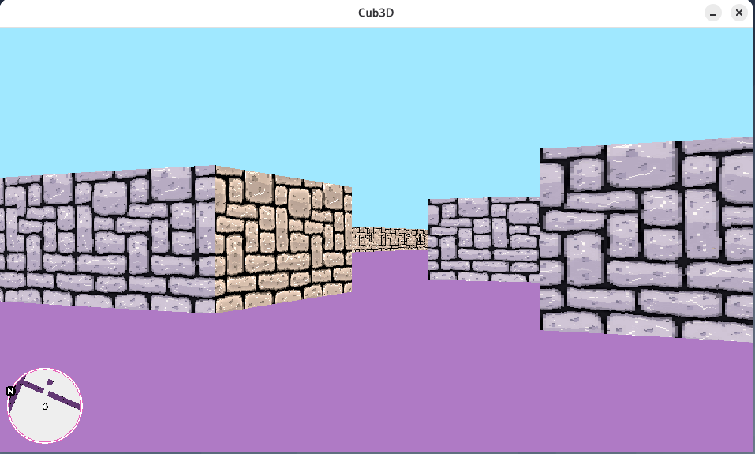
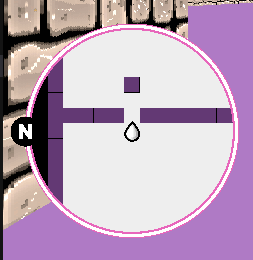
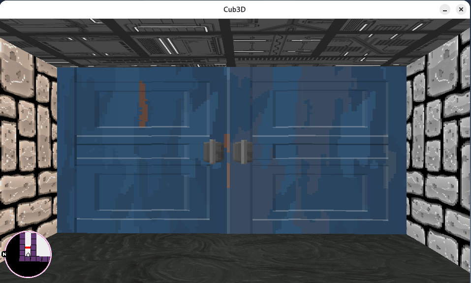
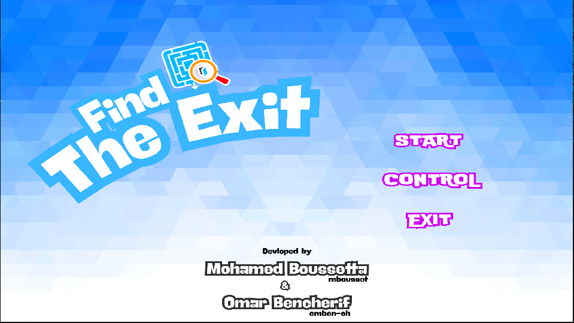
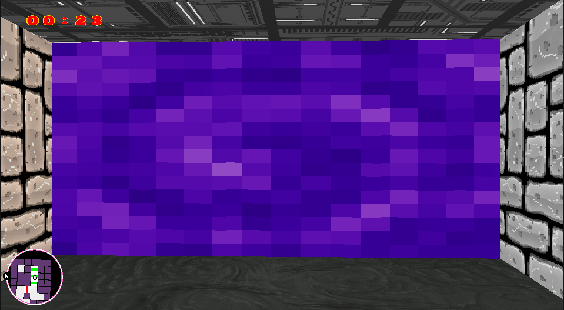
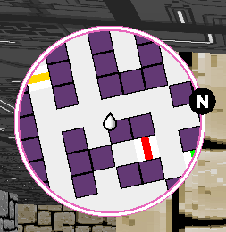

# 🎮 Cub3D – Beyond the Raycasting Limit

> *A high-performance 3D raycasting engine that pushes the boundaries of what's possible in C*

---

## 🌟 Overview

**Cub3D** is a fully optimized 3D raycasting game engine developed as part of the **42 / 1337 School** curriculum. What began as a challenge to creat a game similar to *Wolfenstein 3D* evolved into a sophisticated, modular engine featuring mouse-controlled views, dynamic menus, portals, and in-engine video playback.

### Vision

Build a **performant, expandable, and cleanly engineered system** that maximizes every frame within constrained tools while delivering an immersive visual experience.

---

## ⚙️ Core Design Philosophy

Our approach is built on four pillars:

**Performance First** — Every pixel and ray calculation is meticulously optimized for maximum speed

**Mathematical Precision** — From wall collisions to door mechanics, every motion is computed with accuracy, never approximated

**Engine Modularity** — Clean architecture enables seamless integration of advanced features like portals, video playback, and UI systems

**Immersive Experience** — GTA-style minimap, animated doors, cinematic intros, and responsive controls create a modern gaming feel

---

## 🎯 Mandatory Part – Core Engine

The foundation of Cub3D includes:

- **🧭 DDA Raycasting** — Precise wall collision detection and texture mapping
- **⚡ Optimized Rendering** — Selective redraws targeting only changed regions (sky, floor, walls)
- **🧩 Smart Map Parsing** — Automatic validation, space padding, and comprehensive boundary checks
- **🧮 Advanced Corrections** — Fisheye distortion removal and distance computation reuse
- **🗺️ Interactive Minimap** — GTA-inspired real-time player tracking with directional display

### 📸 Mandatory Visuals

**Main Gameplay View:**  
>


**Minimap System:**  



---

## 🚀 Bonus Part – The Complete Experience

The bonus features transform Cub3D from a technical demo into a fully-fledged game prototype.

### Enhanced Features

- **🧭 Mouse-Controlled View** — Fluid rotation and aiming via mouse movement
- **🖱️ Interactive Doors** — Click to open/close with full raycasting and collision integration
- **🎥 Custom Video Player** — Built with **libav/avcodec** + **OpenSSL** for in-engine HTTPS video streaming
- **🌈 Vertical Look** — Dynamic sky/floor viewing with **↑/↓ arrows**
- **🧩 Flood-Fill Validation** — Guaranteed map enclosure and integrity
- **🧠 Menu System** — Graphical UI with mouse-navigable Start, Exit, and Controls pages
- **🔮 Portal Mechanics** — Functional teleportation system linking map regions
- **🗺️ Enhanced Minimap** — Real-time display of doors, portals, and player movement

### 🎬 Visual Showcase (Bonus Part)

**Gameplay Video Showcase:**  
> 
[Watch Gameplay Video](Game_screenshots/bonus_showcase_video.mp4)

**Door System:**  
> 


**Main Menu & Controls Page:**  
>


**Portal System:**  
>


**Bonus Minimap (With Doors & Portals):**  
>


---

## 🎮 Controls

| Action | Input |
|--------|-------|
| Move Forward/Backward | **W** / **S** |
| Strafe Left/Right | **A** / **D** |
| Rotate View | **←** / **→** |
| Look Up/Down | **↑** / **↓** |
| Menu Interaction | **Mouse Click** |
| Door Interaction | **Left Mouse Click** |
| Mouse Rotation | **Mouse Movement** |
| Exit Game | **ESC** |

---

## 🧩 Project Structure

```
cube3D/
├── bonus/                 → Bonus feature source and assets
├── mandatory/             → Core engine source and assets
├── mlx_linux/             → MiniLibX graphics library
├── Game_screenshots/      → Screenshots and visuals for README
├── Makefile               → Build system
├── README.md              → This README file
├── setup.sh               → Environment setup script
```
---

## 🛠️ Build & Run

```bash
# Install neccesery libs
./setup
# Clone the repository
git clone https://github.com/medob6/cube3D.git
cd cube3D

# Build the project
make

# Run with a map file
./cub3D maps/example.cub
```

---

## ⚡ Technical Highlights

**DDA Raycasting Algorithm** — Accurate wall detection with minimal performance overhead

**Selective Rendering System** — Intelligent redraw strategy targeting only updated regions

**Trigonometric Optimization** — Distance reuse and angle correction for enhanced performance

**Interactive Geometry** — Time-based equations power door and portal mechanics

**FFmpeg Integration** — Real-time video decoding and seamless in-game playback

**Modular Engine API** — Clean separation between rendering, input, and event handling layers

---

## 📚 References & Resources

- [Permadi Raycasting Tutorial](https://permadi.com/1996/05/ray-casting-tutorial-table-of-contents/)
- [MiniLibX Documentation](https://harm-smits.github.io/42docs/libs/minilibx)
- [OpenSSL Documentation](https://www.openssl.org/docs/)
- [Dranger FFmpeg Tutorial](http://dranger.com/ffmpeg/)
- [FFmpeg Wiki – Using libavcodec](https://trac.ffmpeg.org/wiki/Using%20libav*)
- [FFmpeg Official Documentation](https://ffmpeg.org/documentation.html)

---

## 👥 Authors

**Mohamed Boussetta** — Core engine, rendering pipeline, raycasting optimization, video player integration, and performance enhancements

**Omar Bencherif** — Map parsing, UI system, game logic, portal mechanics, and menu integration

---

## 💡 Project Philosophy

Cub3D represents more than fulfilling requirements — it demonstrates how far creativity and engineering discipline can push a minimalist framework. This project proves that C can feel like a modern game engine when wielded with mathematical precision and passion.

> *"The boundaries were the challenge. The performance was the reward."*

---

**Built with dedication at 42 / 1337 School** 🚀
